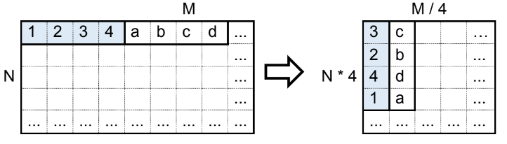

# High_Performance_Processors_Architecture
БГУИР ФКСиС ВМСиС 6 семестр

Лабораторные работы по АВП

[Лабораторная работа №1-2:](№1-2)

Умножение матриц
    
    -double
    -4х8 на 8х8
    

[Лабораторная работа №3:](№3)

Определение степени ассоциативности кэш-памяти

[Лабораторная работа №4:](№4)

Трансформация матриц
 

[Лабораторная работа №5-6:](№5-6)

Свертка изображения

    -Высокочастотный Н2
    -Изображения разного размера 
    -Разделяемая память + корректное обращение по банкам памяти
    -Корректные транзакции

